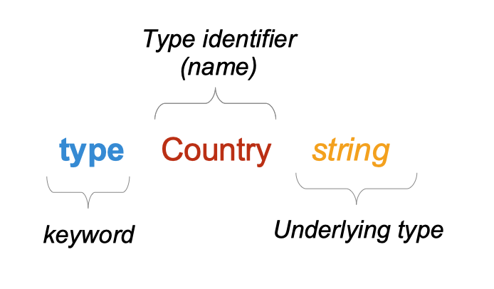
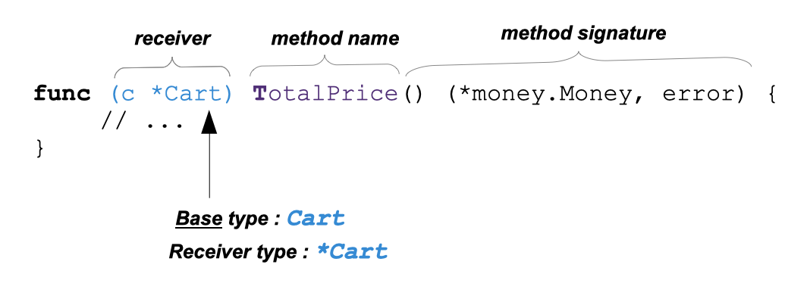

# Reja
* [Types](#types)
* [Methods](#methods)
* [Interfaces](#interfaces)


## Types
* [Types in Go](#a-quick-pointer-primer)

```
type Person struct { 
	FirstName string 
	LastName string
	Age int 
}
```



```
type Score int
type Converter func(string)Score 
type TeamScores map[string]Score
```


## Methods
* [Pointer Receivers and Value Receivers](#pointer-receivers-and-value-receivers)
* [Code Your Methods for nil Instances](#code-your-methods-for-nil-instances)
* [Methods Are Functions Too](#methods-are-functions-too)
* [Type Declarations Aren’t Inheritance](#type-declarations-arent-inheritance)
* [iota Is for Enumerations—Sometimes](#iota-is-for-enumerationssometimes)
* [Use Embedding for Composition](#use-embedding-for-composition)
* [Embedding Is Not Inheritance](#embedding-is-not-inheritance)




```
type Person struct { 
	FirstName string 
	LastName string
	Age int 
}

func (p Person) String() string {
	return fmt.Sprintf("%s %s, age %d", p.FirstName, p.LastName, p.Age)
}
```

Method e'lon qilish va funksiyalar o'rtasida bitta asosiy farq bor: methodlar faqat paket bloklari darajasida aniqlanishi mumkin, funktsiyalar esa har qanday blok ichida aniqlanishi mumkin.

```
p := Person{
    FirstName: "Fred",
    LastName:  "Fredson",
    Age:       52,
}
output := p.String()
```

### Pointer Receivers and Value Receivers

Quyidagi qoidalar har bir turdagi qabul qiluvchidan qachon foydalanishni aniqlashga yordam beradi:
• Agar methodingiz receiverni o'zgartirsa, siz pointer receiverdan foydalanishingiz kerak.
• Agar sizning methodingiz nil instance boshqarishi kerak bo'lsa, siz receiverdan foydalanishi kerak.
• Agar methodingiz receiverni o'zgartirmasa, siz value receiverdan foydalanishingiz mumkin.


```
type Counter struct {
	total       int
	lastUpdated time.Time
}

func (c *Counter) Increment() {
	c.total++
	c.lastUpdated = time.Now()
}

func (c Counter) String() string {
	return fmt.Sprintf("total: %d, last updated: %v", c.total, c.lastUpdated)
}

func main() {
	var c Counter
	fmt.Println(c.String())
	// c.Increment() is converted to (&c).Increment()
	c.Increment()
	fmt.Println(c.String())


	c := &Counter{}
	fmt.Println(c.String())
	c.Increment()
	// c.String() is silently converted to (*c).String()
	fmt.Println(c.String())
}
```

```
func doUpdateWrong(c Counter) {
	c.Increment()
	fmt.Println("in doUpdateWrong:", c.String())
}

func doUpdateRight(c *Counter) {
	c.Increment()
	fmt.Println("in doUpdateRight:", c.String())
}

func main() {
	var c Counter
	doUpdateWrong(c)
	fmt.Println("in main:", c.String())
	doUpdateRight(&c)
	fmt.Println("in main:", c.String())
}
```

### Code Your Methods for nil Instances
```
type IntTree struct {
	val         int
	left, right *IntTree
}

func (it *IntTree) Insert(val int) *IntTree {
	if it == nil {
		return &IntTree{val: val}
	}
	if val < it.val {
		it.left = it.left.Insert(val)
	} else if val > it.val {
		it.right = it.right.Insert(val)
	}
	return it
}

func (it *IntTree) Contains(val int) bool {
	switch {
	case it == nil:
		return false
	case val < it.val:
		return it.left.Contains(val)
	case val > it.val:
		return it.right.Contains(val)
	default:
		return true
	}
}

func main() {
	var it *IntTree
	it = it.Insert(5)
	it = it.Insert(3)
	it = it.Insert(10)
	it = it.Insert(2)
	fmt.Println(it.Contains(2))
	fmt.Println(it.Contains(12))
}
```

### Methods Are Functions Too
```
type Adder struct { 
	start int
}

func (a Adder) AddTo(val int) int { 
	return a.start + val
}

myAdder := Adder{start: 10} 
fmt.Println(myAdder.AddTo(5))

// method value
f1 := myAdder.AddTo
fmt.Println(f1(10))

// method expression:
f2 := Adder.AddTo
fmt.Println(f2(myAdder, 15))

```


### Type Declarations Aren’t Inheritance
```
type Score int
type HighScore Score 
type Person struct { 
	FirstName string 
	LastName string
	Age int 
}
type Employee Person

var i int = 300
var s Score = 100
var hs HighScore = 200 
hs = s
s = i
s = Score(i)
hs = HighScore(s)

var s Score=50
scoreWithBonus := s + 100 // type of scoreWithBonus is Score
```

### iota Is for Enumerations—Sometimes
```
type MailCategory int

const (
	Uncategorized MailCategory = iota
	Personal
	Spam
	Social
	Advertisements
)
```

```
const ( 
	Field1 = 0
	Field2 = 1 + iota 
	Field3 = 20 
	Field4
	Field5 = iota
)

func main() {
	fmt.Println(Field1, Field2, Field3, Field4, Field5)
}
```


```
type BitField int

const (
	Field1 BitField = 1 << iota 
	Field2
	Field3
	Field4
)
```

### Use Embedding for Composition

```
type Employee struct { 
	Name string ID string
}

func (e Employee) Description() string { 
	return fmt.Sprintf("%s (%s)", e.Name, e.ID)
}

type Manager struct { 
	Employee
    Reports []Employee
}

func (m Manager) FindNewEmployees() []Employee {
	// do business logic
}

m := Manager{
    Employee: Employee{
        Name: "Bob Bobson",
        ID:   "12345",
    },
    Reports: []Employee{},
}
fmt.Println(m.ID)
fmt.Println(m.Description())

```
```
type Inner struct { 
	X int
}

type Outer struct { 
	Inner
	X int 
}

o := Outer{
    Inner: Inner{
		X: 10, 
	},
	X: 20, 
}
fmt.Println(o.X) 
fmt.Println(o.Inner.X)
```

### Embedding Is Not Inheritance
```
m := Manager{
		Employee: Employee{
			Name: "Bob Bobson",
			ID:   "12345",
		},
		Reports: []Employee{},
	}
	var eFail Employee = m        // compilation error!
	var eOK Employee = m.Employee 
```

```
type Inner struct {
	A int
}

func (i Inner) IntPrinter(val int) string {
	return fmt.Sprintf("Inner: %d", val)
}

func (i Inner) Double() string {
	result := i.A * 2
	return i.IntPrinter(result)
}

type Outer struct {
	Inner
	S string
}

func (o Outer) IntPrinter(val int) string {
	return fmt.Sprintf("Outer: %d", val)
}

func main() {
	o := Outer{
		Inner: Inner{
			A: 10,
		},
		S: "Hello",
	}
	fmt.Println(o.Double())
}
```


## Interfaces
* [A Quick Lesson on Interfaces]()

### A Quick Lesson on Interfaces
```
type Stringer interface { 
	String() string
}
```

```
type Incrementer interface { 
	Increment()
}
var myStringer fmt.Stringer 
var myIncrementer Incrementer 
pointerCounter := &Counter{} 
valueCounter := Counter{}
myStringer = pointerCounter
myStringer = valueCounter
myIncrementer = pointerCounter
myIncrementer = valueCounter
```