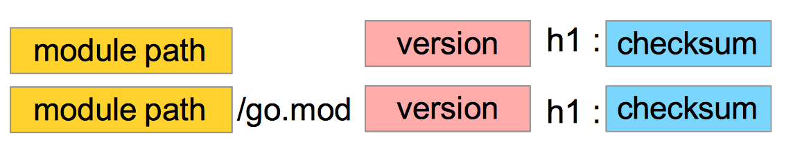

# Reja
## Modules, Packages and Imports Part-2


## Packages
### Building Packages
* [Gracefully Renaming and Reorganizing Your API](#gracefully-renaming-and-reorganizing-your-api)

### Working with Modules
* [Importing Third-Party Code](#importing-third-party-code)
* [Working with Versions](#working-with-versions)
* [Semantic Versioning](#semantic-versioning)
* [Major version 0](#major-version-0)
* [Minimal Version Selection](#minimal-version-selection)
* [Updating to Compatible Versions](#updating-to-compatible-versions)
* [Working with Github](#working-with-github-practice)


## Repositories, Modules, and Packages
- Repository - bu loyiha uchun manba kodi (source code) saqlanadigan versiyalarni boshqarish tizimidagi (VCS) joy 
- Modul - bu yagona birlik sifatida tarqatilgan va versiyalashtirilgan Go manba kodlari (source code) to'plami
- Modullar bir yoki bir nechta paketlardan iborat bo'lib, ular manba kodining kataloglari hisoblanadi. Paketlar modulning tashkil etilishi va tuzilishini beradi

---
### Gracefully Renaming and Reorganizing Your API
> Moduldan bir muncha vaqt foydalangandan so'ng, uning API ideal emasligini tushunishingiz mumkin. 
> Ba'zi eksport qilingan identifikatorlarning nomini o'zgartirishingiz yoki ularni modulingizdagi boshqa paketga ko'chirishingiz mumkin

```Go
type Foo struct { 
	x int
	S string 
}

func (f Foo) Hello() string { 
	return "hello"
}

func (f Foo) goodbye() string { 
	return "goodbye"
}

func MakeBar() Bar { 
	bar := Bar{
		x: 20,
		S: "Hello", 
	}
	
    var f Foo = bar 
	fmt.Println(f.Hello()) 
	return bar
}

```

#### Agar foydalanuvchilarga Bar nomi bilan Foo ni ishlatish usuli: 
```Go
type Bar = Foo
```


### Working with Modules
### Importing Third-Party Code
* Hozirgacha siz fmt, errors, os va math kabi standart kutubxonadan paketlarni import qildingiz. 
* Go tashqi tomon paketlarini birlashtirish uchun xuddi shu import tizimidan foydalanadi. 
* Ko'pgina kompilyatsiya qilingan tillardan farqli o'laroq, Go har doim dasturlarni manba kodidan bitta binary faylga quradi. 
* Bunga modulingizning manba kodi va modulingiz bogʻliq boʻlgan barcha modullarning manba kodlari kiradi

### Example: money-main app
```Go
package main

import (
	"fmt"
	"log"
	"os"

	"github.com/learning-go-book-2e/formatter"
	"github.com/shopspring/decimal"
)

func main() {
	if len(os.Args) < 3 {
		fmt.Println("Need two parameters: amount and percent")
		os.Exit(1)
	}

	amount, err := decimal.NewFromString(os.Args[1])
	if err != nil {
		log.Fatal(err)
	}
	percent, err := decimal.NewFromString(os.Args[2])
	if err != nil {
		log.Fatal(err)
	}

	percent = percent.Div(decimal.NewFromInt(100))
	total := amount.Add(amount.Mul(percent)).Round(2)
	fmt.Println(formatter.Space(80, os.Args[1], os.Args[2], total.StringFixed(2)))
}
```

---
### go.sum

---

### Working with Versions
```Go
package main

import (
	"fmt"
	"log"
	"os"

	"github.com/learning-go-book-2e/simpletax"
	"github.com/shopspring/decimal"
)

func main() {
	amount, _ := decimal.NewFromString(os.Args[1])
	zip := os.Args[2]
	percent, err := simpletax.TaxForZip(zip)
	if err != nil {
		log.Fatal(err)
	}
	total := amount.Add(amount.Mul(percent)).Round(2)
	fmt.Println(total)
}
```

---
#### go list buyrug'i yordamida modulning qaysi versiyalari mavjudligini ko'rishingiz mumkin
```shell
go list -m -versions github.com/learning-go-book-2e/simpletax
```
Odatiy bo'lib, go list buyrug'i modulingizda ishlatiladigan paketlarni ro'yxatini beradi. 
`-m` bayrog'i o'rniga modullarni ro'yxatga olish uchun chiqishni o'zgartiradi va `-versions` bayrog'i o'zgarishlar go ro'yxatini belgilangan modul uchun mavjud versiyalar haqida hisobot berish uchun o'zgartiradi. 
Bunday holda, siz ikkita versiya mavjudligini ko'rasiz, `v1.0.0` va `v1.1.0`.

---
### Semantic Versioning
Versiya raqami quyidagi formatga ega bo'lishi kerak: X.Y.Z

* major (asosiy) version
* minor (kichik) version
* patch (yamoq) version (bug fix)

Bu qanday ishlaydi? X, Y va Z musbat sonlar (boshlovchi nolsiz). 
Bu raqamlar ma'lum bir me'yorga muvofiq oshiriladi.


Dasturiy ta'minotingizning mavjud API'sini buzadigan yangi xususiyatlarni yaratganingizda, siz asosiy versiya raqamini oshirasiz.
eski versiya: `1.0.0` / yangi versiya: `2.0.0`

Mavjud APIni buzmaydigan yangi xususiyatlarni yaratganingizda yoki unumdorlikni oshirsangiz, minor (kichik) versiya raqamini oshirasiz.
eski versiya: `1.0.0` / yangi versiya `1.1.0`

Kodingizdagi xatolikni tuzatsangiz, siz faqat patch (yamoq) versiyasini oshirasiz
eski versiya: `1.0.0` / yangi versiya `1.0.1`

Major (asosiy) versiyani yaratganingizda, siz minor va patch versiyasi raqamini nolga o'rnatasiz. 
Yangi xususiyatni chiqarganingizda, siz yamoq versiyasini nolga o'rnatasiz.

---
### Major version 0
Loyihaning boshlang'ich bosqichida siz hamma narsa o'zgarishini bilasiz; <br>
Sizning umumiy API keyinroq bir xil bo'lmasligi mumkin. <br>
Rivojlanishning ushbu bosqichida siz hali ham versiya yaratishingiz mumkin. <br>
Keyinchalik asosiy raqam 0 ga o'rnatiladi, lekin kichik va yamoq versiyasi raqamini oshirish mumkin. <br>
Boshqa ishlab chiquvchilar sizning kodingizni o'z dasturlariga integratsiyalashganda, sizning dasturiy ta'minotingiz barqaror deb hisoblanmasligini bilishadi (ya'ni umumiy API bildirishnomalarsiz o'zgarishi mumkin).


### Minimal Version Selection
go.mod -> A, B, C -> D

A => v1.1.0 <br>
B => v1.2.0 <br>
C => v1.2.3 <br>

Go D modulni bir martda import qilib v1.2.3 versiyasini tanlaydi
```shell
go mod graph
```

```
github.com/learning-go-book-2e/money github.com/fatih/color@v1.13.0
github.com/learning-go-book-2e/money github.com/mattn/go-colorable@v0.1.9
github.com/learning-go-book-2e/money github.com/mattn/go-isatty@v0.0.14
github.com/fatih/color@v1.13.0 github.com/mattn/go-colorable@v0.1.9
github.com/fatih/color@v1.13.0 github.com/mattn/go-isatty@v0.0.14
github.com/mattn/go-colorable@v0.1.9 github.com/mattn/go-isatty@v0.0.12
```

### Updating to Compatible Versions

```shell
go get github.com/learning-go-book-2e/simpletax@v1.1.0
go get -u=patch github.com/learning-go-book-2e/simpletax
```

### Working with Github (Practice)


