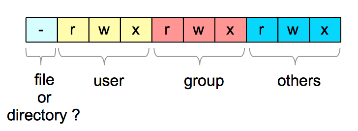
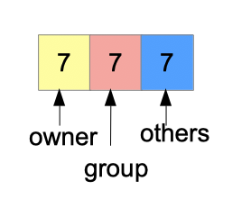
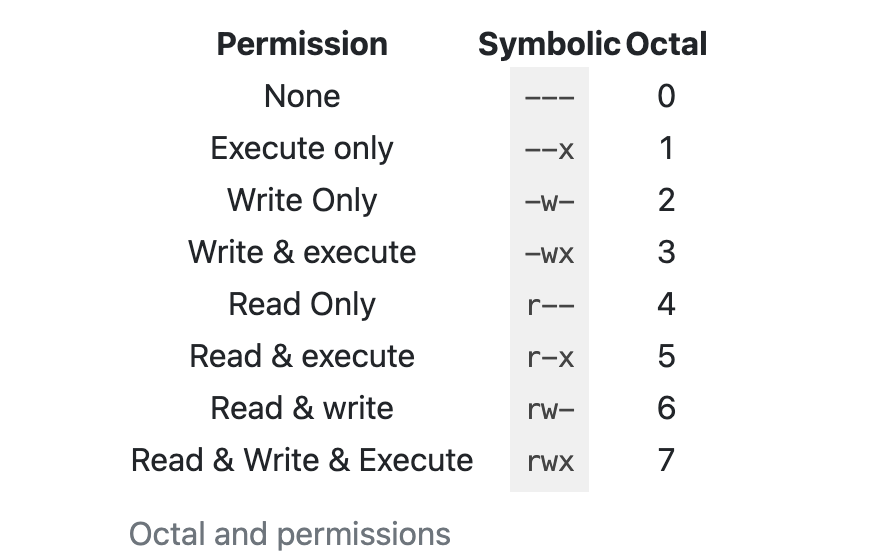

# Reja
## The standard library
* [io](#io)
* [time](#time)
* [JSON](#encodingjson)
* [HTTP](#nethttp)


### io and Friends
* [io and Friends](#io-and-friends)
* [Create a file](#create-a-file)
* [File flags](#file-flags)
* [File mode](#file-mode)

### time
* [Monotonic Time]()

### encoding/json
* [Encode / Decode]()
* [Marshal / Unmarshal]()
* [Data stream]()
* [JSON]()
* [interface implementation]()
* [Using Struct Tags to Add Metadata]()

### net/http
* [The Client]()
* [The Server]()
* [Middleware]()
* [ResponseController]()
* [Structured Logging]()


### io and Friends
```Go
type Reader interface {
	Read(p []byte) (n int, err error)
}

type Writer interface {
	Write(p []byte) (n int, err error)
}
```

```Go
type NotHowReaderIsDefined interface { 
	Read() (p []byte, err error)
}
```

```Go
func countLetters(r io.Reader) (map[string]int, error) {
	buf := make([]byte, 2048)
	out := map[string]int{}
	for {
		n, err := r.Read(buf)
		for _, b := range buf[:n] {
			if (b >= 'A' && b <= 'Z') || (b >= 'a' && b <= 'z') {
				out[string(b)]++
			}
		}

		if err == io.EOF {
			return out, nil
		}
		if err != nil {
			return nil, err
		}
	}
}
```

E'tiborga olish kerak bo'lgan uchta narsa bor
* Birinchidan, siz buferingizni bir marta yaratasiz va uni `r.Read` ga har bir chaqilishida qayta ishlatasiz. Bu potentsial katta ma'lumotlar manbasidan o'qish uchun bitta xotira ajratishdan foydalanish imkonini beradi. Agar o'qish usuli `[]bayt`ni qaytarish uchun yozilgan bo'lsa, u har bir chaqilishida yangi hotira ajratishni talab qiladi
* Ikkinchidan, buferga qancha bayt yozilganligini bilish uchun `r.Read` dan qaytarilgan n qiymatidan foydalanasiz va oʻqilgan maʼlumotlarni qayta ishlagan holda buf subslice pastki boʻlagini takrorlaysiz.
* Nihoyat, `r.Read` dan qaytarilgan `error` `io.EOF` bo'lganda, siz r dan o'qishni tugatganingizni bilasiz. Bu error biroz g'alati, chunki bu error emas. Bu `io.Reader`-dan o'qish uchun hech narsa qolmaganligini bildiradi. `io.EOF` qaytarilgach, natijangizni qaytarasiz

---

`io.Reader` va `io.Writer` misollariga yangi funksiyalar qo'shish uchun boshqa standart funksiyalar mavjud. Bularga quyidagilar kiradi:
* `io.MultiReader`. Bir nechta `io.Reader` lar dan birin-ketin o'qiydigan `io.Reader`ni qaytaradi
* `io.LimitReader`. Taqdim etilgan `io.Reader` dan faqat ma'lum miqdordagi baytgacha o'qiydigan `io.Reader` ni qaytaradi.
* `io.MultiWriter`. Bir vaqtning o'zida bir nechta `io.Writer` misollariga yozadigan `io.Writer`ni qaytaradi

```Go
type Closer interface {
	Close() error 
}

type Seeker interface {
	Seek(offset int64, whence int) (int64, error)
}

f, err := os.Open(fileName) 
if err != nil{
	return nil, err 
}
defer f.Close()
```

### Create a file
```Go
func main() {
    f, err := os.Create("test.csv")
    if err != nil {
        fmt.Println(err)
        return
    }
    // ... success
}
```

`os.Create` quyidagi parametrlar bilan `os.Openfile`-ni ichki chaqiradi:
* Fayl nomi (bu yerda: "`test.csv`")
* Bayroqlar toʻplami (bu yerda: `os.O_RDWR|os.O_CREATE|os.O_TRUNC` )
* Fayl rejimi (bu yerda: `0666`)

```Go
func Create(name string) (*File, error) {
	return OpenFile(name, O_RDWR|O_CREATE|O_TRUNC, 0666)
}
```

### File flags
`os.Openfile` bilan faylni ochganingizda, siz `system call` bajarasiz. <br>
Ushbu `system call` fayl yo'lini va niyatlaringiz haqida qo'shimcha ma'lumotni bilishi kerak. Ushbu ma'lumotlar bo'laklari bayroqlar ro'yxatida davom ettiriladi. 
Ular har xil turdagi bayroqlar:

* `The access mode flags`: ular faylni qanday yaratishimizni belgilaydi. Siz har doim bu bayroqdan birini berishingiz kerak.
* `The creation flags`: ular tizim ishini qanday bajarishimizga ta'sir qiladi
* `The file status flags`: ular fayl ochilgandan so'ng biz bajaradigan barcha operatsiyalarga ta'sir qiladi.

| Flag Name       | Description |
| -----------     | ----------- |
| `os.O_RDONLY`   | Open in a read-only mode. You can just read the file       |
| `os.O_WRONLY`   | Open in write-only mode. You can write only.        |
| `os.O_RDWR`     | Open in read and write mode.        |
| `os.O_CREATE`   | It will create the file if it does not exist.        |
| `os.O_EXCL`     | If used with `os.O_CREATE` it will result in an error if the file already exists            |
| `os.O_TRUNC`    | If the file may be truncated when opened. If something is written on the file, it will be erased.
| `os.O_APPEND`   | If you write to the file, what you write will be appended.|
| `os.O_SYNC`     | Open the file in synchronous mode. The system will wait that all the data has been written  |

<br><br>
---
`os.Create` ni chaqirganizda fayl quyidagi bayroqlar bilan ochiladi:
> `os.O_RDWR|os.O_CREATE|os.O_TRUNC`

Bu shuni anglatadiki, fayl o'qish va yozish rejimida ochiladi. Agar u mavjud bo'lmasa, yaratiladi. Bunga qo'shimcha ravishda, agar iloji bo'lsa, tizim uni qisqartiradi.


Masalan, yangi fayl yaratilganiga ishonch hosil qilish uchun siz bayroqni qo'shishingiz mumkin: `os.O_EXCL`
```Go
f, err := os.OpenFile("test.csv", os.O_RDWR|os.O_CREATE|os.O_TRUNC|os.O_EXCL, 0666)
if err != nil {
    fmt.Println(err)
    return
}
fmt.Println(f)
```

### File mode
`UNIX` tizimlarida har bir fayl bir qator ruxsatlarga ega:

* Fayl egasiga (`owner`) tegishli ruxsatlar

* Fayl tegishli bo'lgan guruh a'zosi (`group`) foydalanuvchilari uchun ruxsatlar

* Boshqa barcha foydalanuvchilar uchun ruxsatlar (`other`)

```shell
$ ls -al
-rw-r--r--  1 zfirdavs  staff  327 Apr 16 07:03 main.go
```

* `-rw-r--r--` : fayl rejimi

* 1: havolalar soni (the number of links)

* `zfirdavs` : fayl egasi

* `staff`: fayl guruhi (the group of the file)

* `327` : fayl baytlari soni

* `Apr 16 07:03`: oxirgi o'zgartirilgan sana.

#### Symbolic notation 
Fayl rejimi uchta blokda tuzilgan (foydalanuvchilar, guruh va dunyoning qolgan qismi uchun ruxsatlar).



Let’s take the example of the following file mode: `-rw-r--r--`

* `First char`: it’s a file

* `User (rw-)`: can read, can write, cannot execute

* `Group (r--)`: can read, cannot write nor execute

* `Rest of the world (r-- )`: can read, cannot write nor execute

```Go
// open the file
f, err := os.Open("temp.txt")
if err != nil {
    fmt.Println(err)
    return
}

// read the file info
info, err := f.Stat()
if err != nil {
    fmt.Println(err)
    return
}
fmt.Println(info.Mode())
```

#### Numeric notation
Rejim sakkizlik songa ham aylantirilishi mumkin (`%o` formatlagich bilan):
```Go
fmt.Printf("Mode Numeric : %o\n", info.Mode())
fmt.Printf("Mode Symbolic : %s\n", info.Mode())
// Mode Numeric : 644
// Mode Symbolic : -rw-r--r--
```




Misol keltiramiz: `644`. 
Keling, uni parchalaymiz:

* Egasi: 6, ya'ni: o'qish + yozish

* Guruh: 4, bu degani: o'qish

* Boshqalar: 4, ya'ni: o'qish

Boshqa misol `777`:

* Egasi: 7, ya'ni: o'qish + yozish + bajarish

* Guruh : 7, ya'ni: o'qish + yozish + bajarish

* Boshqalar: 7, ya'ni: o'qish + yozish + bajarish


