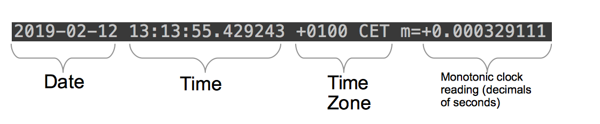
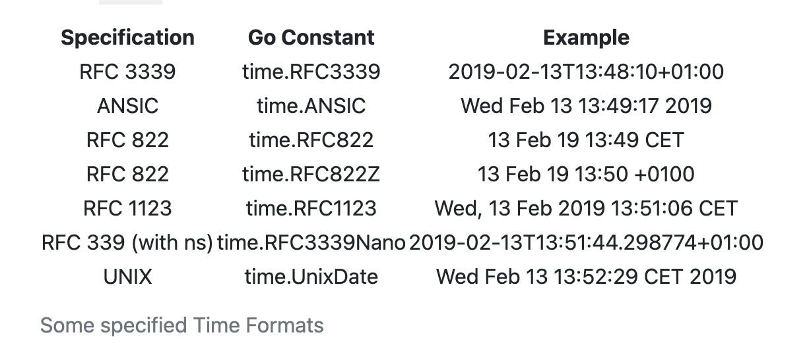

# Reja
## The standard library. Part 2
* [Writing to a file](#writing-to-a-file)
* [time](#time)
* [JSON](#encodingjson)
* [HTTP](#nethttp)


### Writing to a file
* [Writing string to a file](#writing-string-to-a-file)
* [Writing data to a file line by line](#writing-data-to-a-file-line-by-line)
* [Appending to a file](#appending-to-a-file)

### time
* [How to get the current time](#how-to-get-the-current-time)
* [Unix Epoch]()
* [One time, different clocks]()
	* [Hardware Clock]()
    * [Wall Clock]()
    * [Monotonic Clock]()
* [Format the time]()
   * [How to use the Format method]()
       * [The reference time]()
   * [Specified formats]()	   
* [How to print a date in a specific location]()
* [How to parse a date/time contained in a string]()
* [How to get the time elapsed between two points]()
* [`time.Duration` type]()
* [How to check if a time is between two points]()
* [How to add days, hours, minutes, seconds to a time]()
* [Iterate over time]()
* [Questions]()

### encoding/json
* [Encode / Decode]()
* [Marshal / Unmarshal]()
* [Data stream]()
* [JSON]()
* [interface implementation]()
* [Using Struct Tags to Add Metadata]()

### net/http
* [The Client]()
* [The Server]()
* [Middleware]()
* [ResponseController]()
* [Structured Logging]()


### Writing string to a file
```Go

func main() {
	f, err := os.Create("test.txt")
	if err != nil {
		fmt.Println(err)
		return
	}

	l, err := f.WriteString("Hello World")
	if err != nil {
		fmt.Println(err)
		f.Close()
		return
	}

	fmt.Println(l, "bytes written successfully")
	err = f.Close()
	if err != nil {
		fmt.Println(err)
		return
	}
}
```

### Writing data to a file line by line
```Go
func main() {
	f, err := os.Create("lines")
	if err != nil {
		fmt.Println(err)
		return
	}
	defer f.Close()

	d := []string{
		"Welcome to the world of Go1.",
		"Go is a compiled language.",
		"It is easy to learn Go.",
	}

	for _, v := range d {
		fmt.Fprintln(f, v)
		if err != nil {
			fmt.Println(err)
			return
		}
	}

	fmt.Println("file written successfully")
}
```

### Appending to a file
```Go
func main() {
	f, err := os.OpenFile("lines", os.O_APPEND|os.O_WRONLY, 0644)
	if err != nil {
		fmt.Println(err)
		return
	}
	newLine := "File handling is easy."
	_, err = fmt.Fprintln(f, newLine)
	if err != nil {
		fmt.Println(err)
                f.Close()
		return
	}
	err = f.Close()
	if err != nil {
		fmt.Println(err)
		return
	}
	fmt.Println("file appended successfully")
}
```

### How to get the current time
```Go
func main() {
    now := time.Now()
    fmt.Printf("%s\n", now)
}
```

https://uz.wikipedia.org/wiki/UTC#/media/Fayl:World_Time_Zones_Map.png

> Vaqt mintaqasi odamlar o'rtasidagi vaqtni muloqot qilishning muhim elementidir. Agar siz API ishlab chiqayotgan bo'lsangiz va maydonda vaqt chiqarsangiz, foydalanuvchilarga qaysi vaqt mintaqasidan foydalanayotganingizni aytishingiz kerak. Misol uchun, Braziliyadagi "13:13:55" va Stokgolmda "13:13:55" bir xil vaqtni anglatmaydi

---
### UNIX epoch
"Unix Epoch" - 1970-yil 1-yanvar 00:00:00 UTC dan beri o'tgan soniyalar soni.

`time.Time` type dagi o'zgaruvchi bilan `Unix()` methodi bilan `Unix Epoch`-ni olishingiz mumkin.
```Go
now := time.Now()
log.Println(now.Unix())
```

Vaqtni ifodalashning bu usuli aniq. Hech qanday vaqt mintaqasi mavjud emas va siz uni bitta butun sonda saqlashingiz mumkin!

---
### One time, different clocks (Bir vaqt, har xil soatlar)
Kompyuter nuqtai nazaridan, biz odatda "vaqt" deb ataydigan narsa turli xil ta'mlarda keladi. Ammo bu lazzatlarni yaxshiroq tushunish uchun, avvalo, kompyuterlar vaqtni qanday kuzatib borishini tushunishimiz kerak.

#### Uskuna soati (Hardware Clock)

Kompyuteringizning motherboard biriktirilgan vaqtni kuzatib boruvchi kichik apparat qurilmasini topishingiz mumkin.
Ushbu qurilma ichida siz odatda doimiy tezlikda tebranadigan kvarts qismini topishingiz mumkin.  Tebranish uchun unga ozgina energiya kerak bo'ladi.
Kompyuter elektr tarmog'idan uzilganida, bu qurilma vaqtni kuzatishda davom etadi (batareya qolmaguncha).

#### Devor soati (Wall Clock)

Devor soati asosan foydalanuvchiga vaqtni aytib berish uchun ishlatiladi.

#### Monotonik soat

Yana bir soat bor: monotonik soat.  Bu soat vaqtning ikki nuqtasi orasidagi o'tgan vaqtni ko'rsatish uchun ishlatiladi.

Devor soati o'zgarishi mumkin.  Masalan, soat biroz oldinda bo'lishi mumkin.  Shunday qilib, tizim uni mos yozuvlar soati bilan sinxronlashtirishi kerak bo'lishi mumkin.

Shunday qilib, biz ushbu soatga o'tgan vaqtni aniq o'lchashni taklif qila olmaymiz.
O'tgan vaqtni to'g'ri o'lchash uchun bizga doimiy tezlikda vaqt qo'shadigan soat kerak.
Bu monotonik soat.

Doimiy vaqt oʻzgarishi gʻoyasini uning nomidan topishingiz mumkin: monoton “zerikarli, takrorlanuvchi yoki xilma-xillik yoʻq” degan maʼnoni anglatadi.

Go hisoblash davomiyligi ushbu soatdan foydaladi.

### Format the time
`YYYY-MM-DD h:m:s`

```Go
package main

import (
    "fmt"
    "time"
)

func main() {
    now := time.Now()
    fmt.Println(now.Format("Mon Jan 2 "))
}
```



```Go
fmt.Println(time.Now().Format(time.RFC3339))
```
