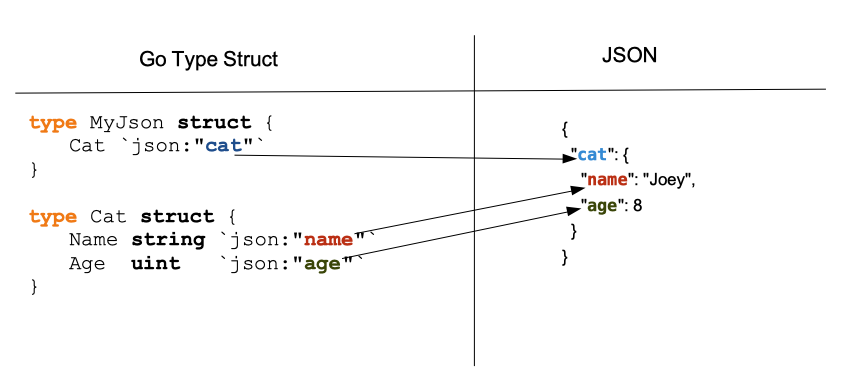

# Reja
## The standard library. Part 3
* [JSON](#encodingjson)

### encoding/json
* [Introduction](#introduction)
* [Encode / Decode](#encode--decode)
* [Marshal / Unmarshal](#marshal--unmarshal)
* [JSON example](#json-example)
* [Marshal JSON](#marshal-json)
* [Unmarshal JSON](#unmarshal-json)
* [Struct tags](#struct-tags)
* * [How to ignore empty fields?](#how-to-ignore-empty-fields)
* * [Skip a field](#skip-a-field)
* * [How to parse the tags of your struct](#how-to-parse-the-tags-of-your-struct)
* * [How to create your tags](#how-to-create-your-tags)
* [Questions]


---
### Introduction
`JSON` ko'pgina zamonaviy ilovalarda qo'llaniladigan formatlardan biridir <br>
Bu juda qulay, chunki ular boshqa formatlarga (masalan, protocol buffers) nisbatan odamlar tomonidan o'qilishi va tushunilishi mumkin. <br>

`JSON (JavaScript Object Notation)` - bu soddaligi va o'qilishi bilan mashhur bo'lgan engil ma'lumotlar almashish formati. JSON haqida ba'zi qiziqarli faktlar:

* Human-Readable: `JSON` ham odamlar, ham mashinalar tomonidan oson o'qilishi uchun mo'ljallangan. Uning sintaksisi `JavaScript` ob'ekt harflariga o'xshaydi, bu esa uni ishlab chiquvchilar uchun intuitiv qiladi.

* Language Agnostic: `JSON` tildan mustaqil, ya'ni u ma'lumotlar almashinuvini qo'llab-quvvatlaydigan har qanday dasturlash tili bilan ishlatilishi mumkin. Bu uning turli texnologiyalar va platformalarda keng qo'llanilishiga yordam berdi.

* Data Types: `JSON` strings, raqamlar, booleans, massivlar, ob'ektlar va `null` qiymatlarni o'z ichiga olgan bir nechta ma'lumotlar turlarini qo'llab-quvvatlaydi. Ushbu moslashuvchanlik ma'lumotlar tuzilmalarining keng doirasini taqdim etishga imkon beradi va `JSON` ni turli xil foydalanish holatlariga moslashtiradi

* Hierarchical Structure: `JSON` ierarxik ma'lumotlar tuzilmalarini qo'llab-quvvatlaydi, bu ichki o'rnatilgan ob'ektlar va massivlarga ruxsat beradi. Bu uni murakkab ma'lumotlar aloqalari va daraxtga o'xshash tuzilmalarni ifodalash uchun juda mos keladi.

* Extensibility: `JSON` kengaytirilishi mumkin, ya'ni uni maxsus ma'lumotlar turlarini yoki qo'shimcha funktsiyalarni qo'llab-quvvatlash uchun osongina kengaytirilishi mumkin. Bu ma'lumotlarni tekshirish uchun `JSON` sxemasi va `JSON` hujjatlarini qisman yangilash uchun J`SON Patch` kabi tegishli spetsifikatsiyalarni ishlab chiqishga olib keldi.

* Serialization and Deserialization: `JSON` `serializatsiyasi` ma'lumotlar ob'ektlarini `JSON` stringga aylantirish jarayonidir, `deserialization` chiqarish esa JSON satrini qayta ma'lumotlar obyektlariga aylantirishning teskari jarayonidir. Ko'pgina dasturlash tillari JSON ma'lumotlarini ketma-ketlashtirish va seriyadan chiqarish uchun o'rnatilgan yordamni ta'minlaydi.

* Support for Unicode: `JSON` matnni bir nechta tillarda va skriptlarda ko'rsatishga imkon beruvchi `Unicode` belgilarni to'liq qo'llab-quvvatlaydi. Bu `JSON` dasturini ilovalarni internationalization va localization uchun mos qiladi.

* Data Exchange Format:  `JSON` zamonaviy web-ishlab chiqarishda web-serverlar va clientlar o'rtasida ma'lumotlar almashinuvi uchun keng qo'llaniladi. U odatda tuzilgan ma'lumotlarni yuborish va qabul qilish uchun `API` (Application Programming Interfaces) da qo'llaniladi


Umuman olganda, `JSON`-ning soddaligi, moslashuvchanligi va keng qo'llab-quvvatlashi uni web-ishlab chiqishdan tortib, `IoT` (Internet of Things) va undan tashqarida turli xil ilovalarda ma'lumotlar almashinuvi uchun mashhur tanlovga aylantirdi.


### Encoding / Decoding
Ko'pincha ilovalar ma'lumotlarni boshqa ilovalarga yoki odamlarga uzatadi. `Go` dasturida biz manipulyatsiya qiladigan ma'lumotlar ko'pincha turdagi struktura shaklida bo'ladi:

```Go
type Cart struct {
    ID   string
    Paid bool
}

cart := Cart{
    ID:   "121514",
    Paid: false,
}
```

Agar biz `cart` o'zgaruvchisidagi ma'lumotlarni boshqa dasturga uzatmoqchi bo'lsak-chi? <br>
Agar bu dastur `Go`'da yozilmagan bo'lsa-chi? Shuning uchun bizga `encoding` (kodlash) kerak.

> `Encoding` - bu ma'lumotlar qismini "kodlangan shakl" ga aylantirish jarayoni.

Xabarni aloqa kanali orqali uzatayotganda, biz qabul qiluvchi xabarni tushunishiga ishonch hosil qilishni xohlaymiz. <br>
Shunday qilib, jo'natuvchi va qabul qiluvchi qaysi `encoding` (kodlash texnikasidan) foydalanishini hal qiladi <br>

Boshqa shaxs bilan gaplashganda, biz fikrlarimizni kodlangan shaklga kodlaymiz: til (ingliz, frantsuz, mandarin...). Gapirayotganda siz fikrlaringizni kodlaysiz. (agar siz gapirishdan oldin o'ylab ko'rsangiz, albatta). 
Biz foydalanadigan tilda xabarimizni tushunarli qilish uchun hurmat qilishimiz kerak bo'lgan qoidalar to'plami mavjud (sintaksis, grammatika ...). Bu barcha "kodlangan shakl" uchun bir xil


> "Kodlangan shakl" dekodlash tufayli asl xabarga qaytarilishi mumkin.

### Marshal / Unmarshal

`Marshaling` va `unmarshaling` ham jarayonni bildiradi.

`Marshaling` - ob'ektni ma'lum bir format yordamida saqlanadigan tasvirga aylantirish jarayoni.

Biz, masalan, `JSON`-da struct tipidagi o'zgaruvchini marshal qilishimiz mumkin <br>
`Unmarshaling` - bu teskari jarayon.

"`Marshaling`" "`kodlash`" bilan bir xil tushunchani anglatadi.  <br>
Biroq, bu atamadan foydalanganda, siz aniq belgilangan ob'ektlar bilan ishlashingizni aniq aytasiz (masalan: `map`, `slice`, `struct` tipidagi o'zgaruvchi...). `Encoder` ma'lumotlar oqimida ishlaydi, `marshaler` ma'lumotlar strukturasida, ob'ektda ishlaydi.

Ma'lumotlar oqimi nima ekanligini so'rashingiz mumkin? Bu tizimga keladigan ma'lumotlar oqimi. <br>
Masalan, tizim tarmoq ulanishi orqali ma'lumotlar oqimlarini, ma'lumotlar oqimlarini qabul qilishi mumkin. Ma'lumotlar oqimini boshqarish murakkab vazifa bo'lishi mumkin, chunki ma'lumotlar bo'laklarga bo'linishi mumkin va ular tartibsiz ravishda kelishi mumkin. Bo'laklarning hajmi ham farq qilishi mumkin, bu esa xotira muammolariga olib kelishi mumkin.

*Xulosa*: biz ma'lumotlar oqimini encode qilamiz, ma'lumotlar strukturasini marshal qilamiz.

### JSON example

```json
[
  {
    "id": 1,
    "first_name": "Annalise",
    "last_name": "Marlin",
    "city": "Bang Bon"
  },
  {
    "id": 2,
    "first_name": "Dacy",
    "last_name": "Biffin",
    "city": "Cuilco"
  },
  {
    "id": 3,
    "first_name": "Wendye",
    "last_name": "Taillard",
    "city": "Preobrazhenka"
  }
]

```

* Bizda 3 ta foydalanuvchi obyektlaridan iborat massiv bor.

* Massiv [ bilan boshlanadi va ] bilan tugaydi

* Har bir ob'ekt jingalak qavs bilan boshlanadi va jingalak qavs bilan tugaydi. (`{}`)

* Har bir foydalanuvchi xususiyati kalit-qiymat juftligi formati bilan yoziladi.
 "id": 3


### Marshal JSON
Joyda `JSON` string yaratish uchun siz ma'lumotlar strukturangizni belgilaydigan turdagi strukturani belgilashingiz kerak. Biz mahsulotlarga havola qiladigan elektron tijorat web-saytini misol qilib olamiz. 
Bizning maqsadimiz mahsulotlarning bir qismidan `JSON` qatorini yaratishdir.

Biz birinchi navbatda `Product` turi strukturasini va `Category` turi tuzilmasini aniqlaymiz (maqola noyob category ga tegishli)

```Go
type Product struct {
    ID    uint64
    Name  string
    SKU   string
    Cat   Category
}

type Category struct {
    ID   uint64
    Name string
}
```

Keyin mahsulot, aniqrog'i, choynakni yaratamiz:
```Go
p := Product{ID: 42, Name: "Tea Pot", SKU: "TP12", Category: Category{ID: 2, Name: "Tea"}}
```

O'zgaruvchimizga ega bo'lgach, `json.Marshal` funksiyasini ishga tushirishimiz mumkin:
```Go
b, err := json.Marshal(p)
if err != nil {
    log.Fatal(err)
}

fmt.Println(string(b))
```

Keyin natijani chop etishimiz mumkin:
```json
{"ID":42,"Name":"Tea Pot","SKU":"TP12","Price":30.5,"Category":{"ID":2,"Name":"Tea"}}
```

```Go
bI, err := json.MarshalIndent(p, "", "   ")
if err != nil {
    log.Fatal(err)
}
fmt.Println(string(bI))
```

`json.MarshalIndent` argumentlari quyidagilardir:

* marshal uchun ma'lumotlar

* prefiks qatori (chiqish natijasining har bir satri ushbu satr bilan boshlanadi). Misolda, bu parametr bo'sh string bilan to'ldirilgan.

* chekinish qatori. Misolda biz `tab` qo'yamiz.

```json
{
    "ID": 42,
    "Name": "Tea Pot",
    "SKU": "TP12",
    "Category": {
        "ID": 2,
        "Name": "Tea"
    }
}
```

Odatda, `JSON`-da xususiyatlar nomlari bosh harf bilan boshlanmaydi. Bu erda `json` to'plami hech qanday o'zgartirishlarsiz Product tuzilmamiz maydonlarining nomini oldi.

Chop etilgan natijani boshqarish uchun Product tarkibiga teglar qo'shilishi mumkin:

```Go
type Product struct {
    ID       uint64   `json:"id"`
    Name     string   `json:"name"`
    SKU      string   `json:"sku"`
    Category Category `json:"category"`
}
type Category struct {
    ID   uint64 `json:"id"`
    Name string `json:"name"`
}
```

```json
{
    "id": 42,
    "name": "Tea Pot",
    "sku": "TP12",
    "category": {
        "id": 2,
        "name": "Tea"
    }
}
```


### Unmarshal JSON
`JSON` o'z ichiga olgan qatorni dekodlash uchun siz turdagi tuzilmalarni yaratishingiz kerak bo'ladi. <br>
Tasavvur qiling-a, siz quyidagi `JSON` string dekodlashni xohlaysiz:

```json
{
  "cat": {
    "name": "Joey",
    "age": 8
  }
}
```

Bizda ikkita xususiyatga ega bo'lgan boshqa ob'ektga teng bo'lgan mushuk xususiyatiga ega ob'ekt mavjud: ism va yosh. <br>
Agar siz dekodlashni xohlasangiz, avval ma'lumotlarni saqlaydigan strukturani yaratishingiz kerak.

Biz birinchi navbatda mushuk strukturasini ushlab turuvchi strukturani yaratamiz:
```Go
type MyJson struct {
    Cat
}
```

Keyin biz `Cat` strukturasini aniqlaymiz:
```Go
type Cat struct {
    Name string
    Age uint
}
```

```Go
func main() {
    myJson := []byte(`{"cat":{ "name":"Joey", "age":8 }}`)
    c := MyJson{}
    err := json.Unmarshal(myJson, &c)
    if err != nil {
        log.Fatal(err)
    }

    fmt.Println(c.Cat.Name)
    fmt.Println(c.Cat.Age)
}
```

#### Struct Tags
```Go
type MyJson struct {
    Cat `json:"cat"`
}

type Cat struct {
    Name string `json:"name"`
    Age  uint   `json:"age"`
}
```

`Unmarshaler` `JSON`dagi maydonlarni topa oladi. Ularga reflect paketi orqali kirish mumkin 
(aniqrog'i teg `reflect.StructField` strukturasining maydonidir)



### Struct tags
Oldingi ikkita bo'limda biz kodlangan `JSON` tuzilishini teglar bilan boshqarishimiz mumkinligini ko'rdik. <br>
Shuningdek, biz `JSON` stringni dekodlashni va strukturamizning maydon nomini `JSON` xususiyatlari nomiga moslashtirishni o'rgandik.


#### How to ignore empty fields
Agar o'zgaruvchingizning maydonlaridan biri o'rnatilmagan bo'lsa, u standart nol qiymatiga ega bo'ladi. <br>
Odatiy bo'lib, u `json.Marshal` yoki `json.MarshalIndent `tomonidan yaratilgan `JSON` qatorida mavjud bo'ladi:
```Go
type Product struct {
    ID   uint64 `json:"id"`
    Name string `json:"name"`
}

func main() {
    p := Product{ID: 42}
    bI, err := json.MarshalIndent(p, "", "  ")
    if err != nil {
        log.Fatal(err)
    }
    fmt.Println(string(bI))
}
```

```json
{
    "id": 42,
    "name": ""
}
```

Bu erda maydon nomi bo'sh qatordir. Chiqarilgan `JSON` dan yo'q bo'lib ketishi uchun struct tegiga `omitempty` direktivasini qo'shishimiz mumkin:
```Go
type Product struct {
    ID   uint64 `json:"id"`
    Name string `json:"name,omitempty"`
}
```
```json
{
    "id": 42

}
```

#### Skip a Field
Foydalanish tartibi oddiy, sizda o'nta maydonli `struct` mavjud va siz uni `JSON` string kodlangan versiyasida yashirishni xohlaysiz (masalan, bu maydon mijozlaringiz tomonidan endi foydalanilmaydi). <br>
Siz nima qila olasiz, uni tuzilmangizdan olib tashlashdir. <br>
Agar siz hali ham kodingizning qolgan qismida ushbu maydondan foydalansangiz, bu yechim yaxshi emas.

Buning uchun ko'rsatma mavjud: `-`
```Go
type Product struct {
    ID          uint64 `json:"id"`
    Name        string `json:"name,omitempty"`
    Description string `json:"-"`
}
```

Bu erda biz `json` paketiga kodlangan satrdagi `Description` maydonini chiqarmaslikni aytamiz.

#### How to parse the tags of your struct
`reflect` paketidan foydalanib, turdagi strukturadagi teglar qiymatini olishingiz mumkin:
```Go
type Product struct {
    ID          uint64 `json:"id"`
    Name        string `json:"name,omitempty"`
    Description string `json:"-"`
}

func main() {
    p:= Product{ID:32}
    t := reflect.TypeOf(p)
    for i := 0; i < t.NumField(); i++ {
        fmt.Printf("field Name : %s\n",t.Field(i).Name)
        fmt.Printf("field Tag : %s\n",t.Field(i).Tag)
    }
}
```

Bu erda biz birinchi navbatda har bir maydonda teglari bo'lgan uchta maydonni o'z ichiga olgan `Product` turini aniqlaymiz. Keyin asosiy funktsiyada biz `p` nomli yangi o'zgaruvchini (`Product` tipidagi) yaratamiz. Tur ma'lumotlari standart paket aks ettirishning `TypeOf` funksiyasi bilan olinadi.

`TypeOf` funksiyasi `Type` tipidagi elementni qaytaradi! `NumField()` methodi strukturadagi maydonlar sonini qaytaradi. Bizning holatda, u 3 ni qaytaradi.

Keyin biz maydon indeksini argument sifatida qabul qiladigan `Field()` methodi yordamida strukturaning maydonlarini takrorlaymiz. Bu oxirgi funksiya `StructField` tipidagi o‘zgaruvchini qaytaradi:

```Go
// package reflect
// file: type.go
type StructField struct {
    Name      string
    PkgPath   string
    Type      Type
    Tag       StructTag
    Offset    uintptr
    Index     []int
    Anonymous bool
}
```

Va endi `Lookup` methodida misol. <br>
`Lookup` usulining maqsadi teg bor yoki yo'qligini aniqlashdir:

```Go
if tagValue, ok := t.Field(i).Tag.Lookup("test"); ok {
    fmt.Println(tagValue)
} else {
    fmt.Println("no tag 'test'")
}
```

### How to create your tags 
`JSON` tegi qulay; maxsus foydalanish holatlari uchun o'z struktura teglarini yaratishni xohlashingiz mumkin. Til ma'lum bir sintaksisni kutadi: